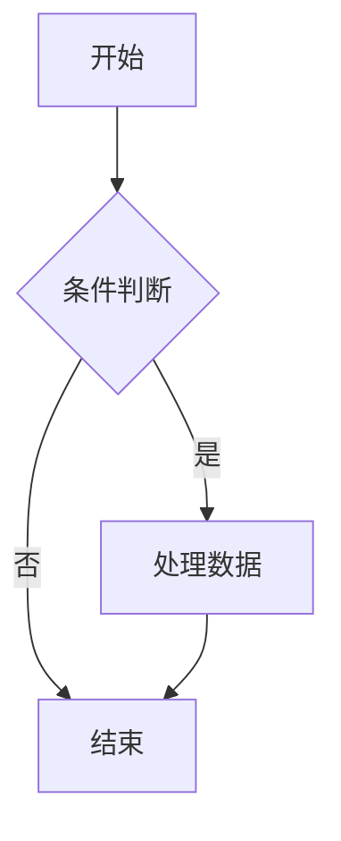
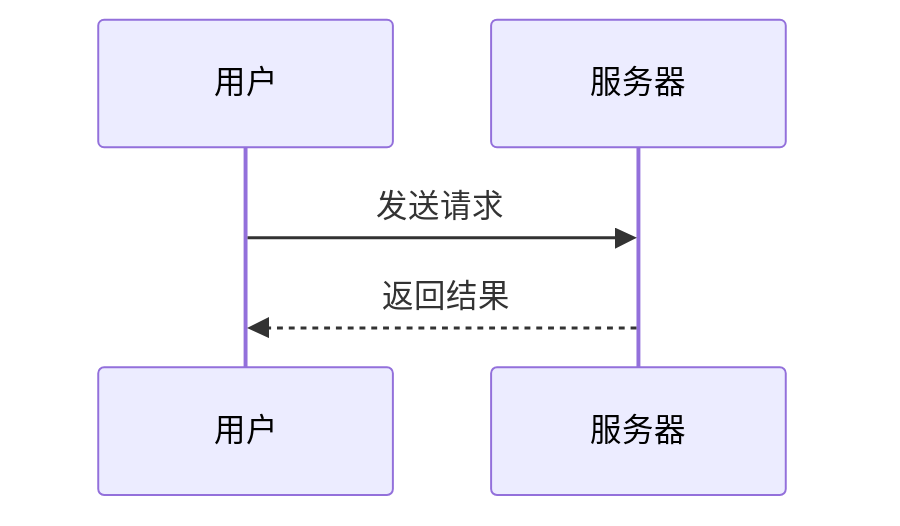

# Pecia Markdown 功能测试

> 本文件用于验证 Pecia 的 Markdown 预览能力：每种特性给出 1–2 个示例。
> 图片分两类：**本地样例**（同目录下的图片文件）与**在线图片**（中国大陆可直连）。

---

## 1. 标题 Headings

# 一级标题
## 二级标题
### 三级标题
#### 四级标题
##### 五级标题
###### 六级标题

标题（Setext 风格，用底线）：

一级标题
========

二级标题
--------

## 2. 段落与换行

这是一个普通段落。

行尾加两个空格会产生软换行：  
这一行紧接在上一行下面，属于同一段落。

空行分隔的这一段，才是新的段落。

## 3. 文本样式

*斜体*、_斜体_、**粗体**、__粗体__、***粗斜体***、~~删除线~~、`行内代码`。

HTML 标签：<b>粗体</b>、<i>斜体</i>、<u>下划线</u>、<s>删除线</s>、<sub>下标</sub>、<sup>上标</sup>。

化学式：H<sub>2</sub>O、CO<sub>2</sub>；平方：x<sup>2</sup> + y<sup>2</sup> = z<sup>2</sup>。

颜色：<span style="color:#C0392B;">红色文字</span> · <span style="color:#2E86AB;">蓝色文字</span>

## 4. 引用 Blockquote

> 单层引用。引用里同样可以使用 **粗体**、*斜体* 和 `行内代码`。

> 第一层
>> 嵌套第二层
>>> 嵌套第三层

## 5. 列表 Lists

无序列表（`-`）：

- 项目一
- 项目二
  - 嵌套 2.1
  - 嵌套 2.2

无序列表（`*`）：

* 星号一
* 星号二

有序列表：

1. 第一项
2. 第二项
   1. 嵌套 2.1
   2. 嵌套 2.2
3. 第三项

任务列表（GFM）：

- [x] 已完成的任务
- [ ] 未完成的任务
- [ ] 父任务
  - [x] 子任务（已完成）
  - [ ] 子任务（待办）

## 6. 代码 Code

行内代码：`npm install`、`std::vector<int>`、`Ctrl + Shift + P`。

无语言围栏代码块：

```
plain text without language
line two
```

Python：

```python
def fib(n):
    a, b = 0, 1
    for _ in range(n):
        a, b = b, a + b
    return a
```


## 7. 表格 Tables

基础表格：

| 名称   | 版本  | 许可         |
|--------|-------|--------------|
| Pecia  | 1.0.2 | AGPL-3.0     |
| FLTK   | 1.4.5 | FLTK License |
| md4c   | 2026-09-11 (10fa4f44) | MIT    |

列对齐（左 / 中 / 右）：

| 左对齐 | 居中 | 右对齐 |
|:-------|:----:|-------:|
| A      | B    | 12345  |
| C      | D    | 678    |

单元格内可含行内格式：

| 组件      | 说明         |
|-----------|--------------|
| `ropey`   | **文本缓冲** |
| ~~旧方案~~ | 已废弃       |

## 8. 链接 Links

行内链接（带标题）：[Pecia 仓库](https://gitee.com/qiuzongman/pecia "项目主页")

引用式链接：[Pecia 仓库][repo]

[repo]: https://gitee.com/qiuzongman/pecia

自动链接：<https://gitee.com/qiuzongman/pecia>

裸 URL 自动识别： https://www.baidu.com

（注：裸 URL 前须为空格或行首，紧贴全角标点时 md4c 不会识别为链接。）

邮箱链接：[写信给我](mailto:qiuzongman@foxmail.com)

## 9. 分隔线 Horizontal Rule

---

***

## 10. 转义与特殊符号

反斜杠转义：\*不是斜体\*、\_不是斜体\_、\`不是代码\`、\[不是链接\]、\\ 是反斜杠本身。

HTML 实体：&copy; &reg; &trade; &yen; &euro; &pound; &plusmn; &times; &divide; &laquo; &raquo; &hellip; &mdash; &middot;

数学与单位符号：X² Y³ ¾ ¼ ½ °C ± ∞ ≠ ≤ ≥ ≈

Emoji：🎉 ✅ ⚠️ 📄 🚀 🔒

## 11. 图片 Images

### 11.1 本地样例（不同格式）

PNG：


带透明通道的 PNG（RGBA）：


JPG：


GIF（动画，会自动播放）：


WebP（**注意**：内置解码器 stb_image 不支持 WebP，此处会显示"不支持格式"占位图——用于验证降级表现）：


BMP：


SVG（矢量）：


尺寸大于 200px 的图片（预览会自动等比缩放到 200px）：


### 11.2 在线图片（中国大陆可直连）

本项目 Gitee 仓库的原始文件（raw 直链，PNG）：


本项目 Gitee 仓库的矢量图（raw 直链，SVG，由 resvg 渲染）：


百度站内图片（PNG）：


腾讯 CDN 动画 GIF（22 帧）：


### 11.3 在线图片（海外 CDN，部分网络可能无法访问）

在线 JPG：

在线 WebP：

### 11.4 图片作为链接

[](https://gitee.com/qiuzongman/pecia "点击后打开 Pecia 仓库")

## 12. 数学公式 Math（RaTeX / KaTeX）

行内公式：质能方程 $$E = mc^{2}$$ 就写在一行文字里。

单行块级公式：

$$\int_{0}^{1} x^{2}\,\mathrm{d}x = \frac{1}{3}$$

二次方程求根公式：

$$
x = \frac{-b \pm \sqrt{b^{2} - 4ac}}{2a}
$$

多行对齐（aligned）：

$$
\begin{aligned}
(a + b)^{2} &= a^{2} + 2ab + b^{2} \\
(a - b)^{2} &= a^{2} - 2ab + b^{2}
\end{aligned}
$$

分段函数（cases）：

$$
f(x) = \begin{cases}
1,  & x > 0 \\
0,  & x = 0 \\
-1, & x < 0
\end{cases}
$$

矩阵：

$$
A = \begin{pmatrix} a & b \\ c & d \end{pmatrix},
\qquad \det A = ad - bc
$$

求和与极限：

$$
\lim_{n \to \infty} \sum_{k=1}^{n} \frac{1}{k^{2}} = \frac{\pi^{2}}{6}
$$

代码块公式（围栏标记为 math）：

```math
\nabla \cdot \mathbf{E} = \frac{\rho}{\varepsilon_{0}}
```

## 13. 流程图 Mermaid





## 14. 原始 HTML

<span style="color:red;">红色 span</span> · <span style="color:#2E86AB;font-weight:bold;">蓝色加粗 span</span>

<blockquote>用 HTML 标签写的引用块</blockquote>

---

## 15. 高亮 Highlight

行内高亮：==高亮文本==，可与 **粗体** 混用，例如 ==**重点**== 或者 **==重点2==**


## 16. 脚注 Footnotes

正文内的引用 [^1] 会渲染为上标链接，点击可跳转到文末脚注定义区。

再来一个引用 [^2]，多个脚注按首次出现顺序编号。

[^1]: 脚注一：md4c 的 FOOTNOTES 扩展会把所有定义自动归集到文档末尾。
[^2]: 脚注二：脚注内可包含 **行内格式** 与 `代码`。

## 17. 警告框 Callouts / Admonitions

> [!NOTE]
> 说明性信息，用于补充背景或备注。

> [!TIP]
> 小贴士，给出建议或技巧。

> [!IMPORTANT]
> 重要信息，需要用户特别注意。

> [!WARNING]
> 警告，提示可能存在的风险。

> [!CAUTION]
> 危险，操作需格外谨慎。


*示例文件结束。*
